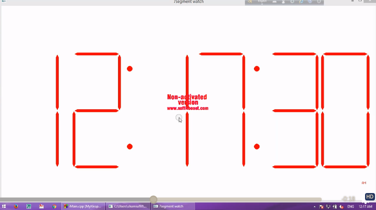

# 7-Segment Digital Clock Using iGraphics in C Language

iGraphics library of C was used to build this project.

# How to run this project? 
iMain.cpp file is the main file. I ran it on windows 10 machine. If you can run it on Ubuntu machine or any other platforms, please make a pull request and contribute. I couldn't find a way to run ```iGraphics.h``` file on Ubuntu machine as it uses some Windows specific API calls like ```stdcall IA0``` and others. 
Installing process is given in the pdfs and docs. Use Codeblocks and windows machine make things easier.

## Screenshot and Video Link

